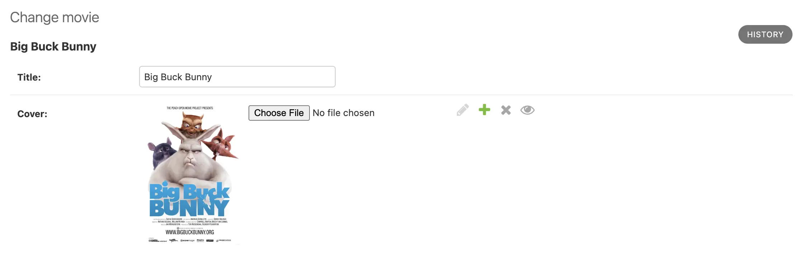

=================
Getting Started
=================

Installation
============

Django Anchor is installed just like any other Django package: add the package
as a dependency and then add ``anchor`` to your ``INSTALLED_APPS`` setting.

Check out the :doc:`installation guide </installation>` for more details.

Introduction
============

Django Anchor allows you to add files to your Django models. It is intended to
replace Django FileFields and ImageFields and provide a bit more functionality.
Files can be attached in one of two ways:

- **Attaching a single file** by adding an
  :py:class:`anchor.models.fields.BlobField` to your model.
- **Attaching multiple files** by creating
  :py:class:`anchor.models.attachment.Attachment` objects which link
  :py:class:`anchor.models.blob.Blob` objects to your model objects via a generic relationship.

Single File Attachments
=======================

We'll focus on adding single objects first, building on the example from the
demo project. Let's say you have a ``Movie`` model and want to upload cover
images. First, add a ``BlobField`` to your model:

.. code-block:: python

    from django.db import models
    from anchor.models.fields import BlobField

    class Movie(models.Model):
        title = models.CharField(max_length=100)
        cover = BlobField()

That's pretty much it! Just like with any other model field, you need to run
``python manage.py makemigrations`` and ``python manage.py migrate`` to create
the migration and apply changes to the database.

Rendering attachments in templates
==================================

One of the core functionalities of Django Anchor is the ability to render
versions of the original file attached to a model that are optimized for a
particular size or converted to another format. This is done using the
:py:func:`blob_thumbnail <anchor.templatetags.anchor.blob_thumbnail>` template tag, which takes a
``Blob`` object as the first argument and optional format parameters to build a
variant.

Let's say you want to render a grid of Movie cover thumbnails in a list view.
Your template could look something like this:

.. code-block:: html+django

    
    <ul>
    
        <li>
            
            <h2>{{ movie.title }}</h2>
        </li>
    
    </ul>

Using BlobFields in forms
=========================

Django Anchor includes a form field for handling file uploads that is designed
to be compatible with Django's FileField. It will be used by default if you use
model forms and you can add it to your own forms as well:

.. code-block:: python

    from django import forms
    from anchor.forms.fields import BlobField

    class MovieForm(forms.ModelForm):
        class Meta:
            model = Movie
            fields = ['title', 'cover']

    # or

    class MovieForm(forms.Form):
        title = forms.CharField(max_length=100)
        cover = BlobField()

Multiple File Attachments
=========================

If you need to attach a list any number of files to a model you need to use the
:py:class:`Attachment <anchor.models.attachment.Attachment>` model. This model
links Blob objects to your model objects via a `generic Django relations
<https://docs.djangoproject.com/en/5.0/ref/contrib/contenttypes/#generic-relations>`_.

To do so, just create Attachment objects for each file you want to attach like
this:

.. code-block:: python

    from django.db import models
    from anchor.models.attachment import Attachment

    movie = Movie.objects.create(title='My Movie')
    scene1_attachment = Attachment.objects.create(
        blob=Blob.objects.from_path('path/to/scene1.jpg'),
        content_object=movie,
        name='scenes',
        order=0,
    )
    scene2_attachment = Attachment.objects.create(
        blob=Blob.objects.from_path('path/to/scene2.jpg'),
        content_object=movie,
        name='scenes',
        order=1,
    )
    scene3_attachment = Attachment.objects.create(
        blob=Blob.objects.from_path('path/to/scene3.jpg'),
        content_object=movie,
        name='scenes',
        order=2,
    )

The ``name`` field is used to group attachments together. It doesn't need to be
set (it defaults to ``'attachments'``) but is helpful if you have multiple
collections of files that you want to attach to a model.

The ``order`` field is used to sort the attachments in the order you want them
and must be unique for each attachment in the same collection (with the same
``name`` and ``content_object``).

Django attachments doesn't provide a default way to generate the reverse generic
relationship but you can do so yourself by adding a property to your model:

.. code-block:: python

    from django.db import models
    from anchor.models.attachment import Attachment

    class Movie(models.Model):
        title = models.CharField(max_length=100)

    @property
    def scenes(self):
        return (
            Attachment.objects.select_related("blob")
            .filter_by_object(self, name="scenes")
            .order_by("order")
            .all()
        )

Keep in mind that this is not optimal if you're loading multiple movies at the
same time (since it'll perform N+1 queries). Suggestions on how to improve this
or make some standard way within the Django Anchor package are always welcome!

To render attachments in templates, you can use the same
:py:func:`blob_thumbnail <anchor.templatetags.anchor.blob_thumbnail>` template
tag as with BlobFields:

.. code-block:: html+django

    
    <ul>
    
        <li>
            
        </li>
    
    </ul>

Admin integration
=================

Django Anchor provides a custom admin widget for BlobFields that allows you to
use them like normal FileFields in the Django admin:

.. image:: _static/img/django_admin_default_widget.png.webp
   :alt: Django Anchor admin widget for BlobFields

If you inherit from :py:class:`anchor.admin.BlobAdminMixin` in your admin class,
you'll get a widget with a preview of the file instead of a link to the File:

Django Anchor also provides an admin inline to manage attachments. Add
:py:class:`anchor.admin.AttachmentInline` to your model admin to manage
attachments in the Django admin:

.. image:: _static/img/django_admin_attachments_inline.png.webp
   :alt: Django Anchor admin inline for Attachment objects
